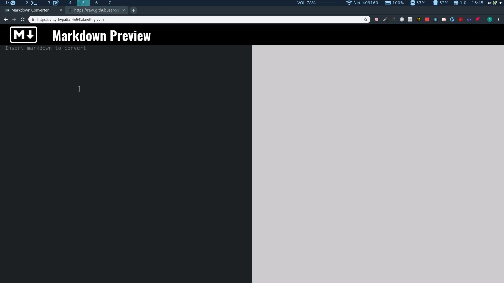

## Real-time markdown editor

Markdown editor converts markdown syntax or html to styled text and displays it in real time. The app was built to help with writing github README.md files but it can also be used for anything that needs markdown. App is made with HTML5, CSS3(SCSS) and React..

**Live page:** <a  href="https://projects.darkokojovic.com/markdown-editor/">here</a>

#### Quick overview:

<!-- <iframe  src="https://player.vimeo.com/video/352279175"  width="800"  height="455"  frameborder="0"  allow="autoplay; fullscreen"  allowfullscreen></iframe> -->

**Video:**
 

#### Technologies used:

- HTML5

- CSS3(Sass)

- Javascript(ReactJS)
